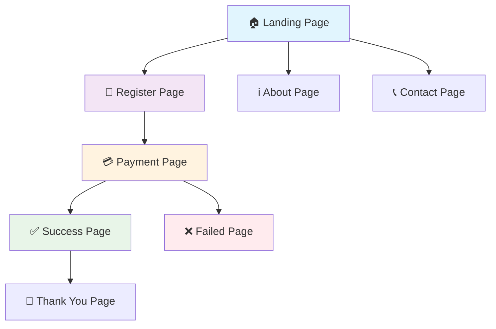
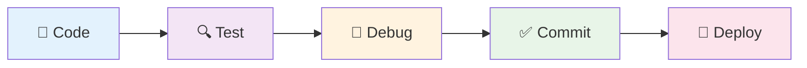

# 🚀 Webinar Sales Funnel App

<div align="center">

[](https://reactjs.org/)
[](https://nodejs.org/)
[](https://developer.mozilla.org/en-US/docs/Web/JavaScript)
[](LICENSE)

A comprehensive full-stack application built with **React** frontend and **Node.js** backend for managing webinar sales funnels. This application provides a complete solution for webinar registration, payment processing, and lead management with **n8n webhook integration**.

[🚀 Quick Start](#-installation--setup) • [📖 Documentation](#-api-endpoints) • [🛠 Tech Stack](#-tech-stack) • [🤝 Contributing](#-contributing)

</div>

---

## 📋 Table of Contents

- [🔍 Overview](#-overview)
- [✨ Features](#-features) 
- [🛠 Tech Stack](#-tech-stack)
- [📁 Project Structure](#-project-structure)
- [📋 Prerequisites](#-prerequisites)
- [🚀 Installation & Setup](#-installation--setup)
- [🏃‍♂️ Running the Application](#️-running-the-application)
- [🌐 API Endpoints](#-api-endpoints)
- [🖥️ Frontend Pages](#️-frontend-pages)
- [🔧 Environment Variables](#-environment-variables)
- [💻 Development](#-development)
- [🚀 Production Deployment](#-production-deployment)
- [🔧 Troubleshooting](#-troubleshooting)
- [🤝 Contributing](#-contributing)
- [📞 Support](#-support)

## 🔍 Overview

The **Webinar Sales Funnel App** is designed to handle the complete customer journey from landing page to webinar attendance. It includes lead capture, payment processing simulation, webinar registration, and attendance tracking with seamless integration to external systems via webhooks.

> 🎯 **Perfect for**: Marketing teams, course creators, and businesses running webinar-based sales funnels

### 🎯 Key Capabilities

| Feature | Description | Status |
|---------|-------------|--------|
| 👥 **Lead Management** | Capture and process leads from various sources | ✅ Active |
| 💳 **Payment Processing** | Simulate payment flows with success/failure handling | ✅ Active |
| 🎪 **Webinar Registration** | Complete registration system with countdown timers | ✅ Active |
| 📊 **Attendance Tracking** | Monitor and record webinar attendance | ✅ Active |
| 📞 **Contact Forms** | Handle customer inquiries and support requests | ✅ Active |
| 🔗 **Webhook Integration** | Ready for n8n or other automation tools | ✅ Active |

## ✨ Features

<details>
<summary><strong>🎨 Frontend Features</strong> (Click to expand)</summary>

- 🎨 **Modern UI/UX**: Clean, responsive design with gradient effects
- ⏱️ **Real-time Countdown**: Dynamic countdown timer for webinar start
- 📱 **Mobile Responsive**: Optimized for all device sizes
- 🛣️ **Client-side Routing**: Smooth navigation with React Router
- 💾 **Local Storage**: Persistent user data across sessions
- 🔔 **Error Handling**: Comprehensive error handling with user feedback
- 🎯 **Lead Capture Forms**: Multi-step registration process
- 💳 **Payment Simulation**: Mock payment processing interface

</details>

<details>
<summary><strong>⚙️ Backend Features</strong> (Click to expand)</summary>

- 🔐 **Security**: Helmet.js security headers and CORS protection
- 🚦 **Rate Limiting**: Configurable request rate limiting
- ✅ **Input Validation**: Comprehensive request validation with express-validator
- 📊 **Logging**: Morgan HTTP request logging
- 🌐 **Webhook Integration**: n8n webhook support for external automation
- 🏥 **Health Monitoring**: Health check endpoints for monitoring
- 🔄 **Graceful Error Handling**: Structured error responses
- 📈 **Performance Monitoring**: Request timing and monitoring

</details>

## 🛠 Tech Stack

<div align="center">

### 🎨 Frontend
[](https://reactjs.org/)
[](https://reactrouter.com/)
[](https://axios-http.com/)
[](https://developer.mozilla.org/en-US/docs/Web/CSS)

### ⚙️ Backend
[](https://nodejs.org/)
[](https://expressjs.com/)
[](https://github.com/expressjs/cors)
[](https://helmetjs.github.io/)

### 🔧 Development Tools
[](https://nodemon.io/)
[](https://github.com/open-cli-tools/concurrently)

</div>

<details>
<summary><strong>📦 Detailed Dependencies</strong> (Click to expand)</summary>

**Frontend:**
- **React 18.2.0**: Modern React with hooks and functional components
- **React Router DOM 6.20.1**: Client-side routing
- **Axios 1.6.2**: HTTP client for API communication  
- **Lucide React 0.294.0**: Modern icon library
- **CSS3**: Custom styling with gradients and animations

**Backend:**
- **Node.js**: JavaScript runtime environment
- **Express.js 4.18.2**: Web application framework
- **CORS 2.8.5**: Cross-origin resource sharing
- **Helmet 7.1.0**: Security middleware
- **Morgan 1.10.0**: HTTP request logger
- **Express Rate Limit 7.1.5**: Rate limiting middleware
- **Express Validator 7.0.1**: Input validation and sanitization
- **Axios**: HTTP client for external API calls
- **dotenv 16.3.1**: Environment variable management

**Development Tools:**
- **Nodemon 3.0.2**: Development server auto-restart
- **Concurrently 8.2.2**: Run multiple npm scripts simultaneously
- **React Scripts 5.0.1**: Create React App build tools

</details>

## 📁 Project Structure

<details>
<summary><strong>🗂️ Click to view project structure</strong></summary>

```
Webinar-Sales-Funnel-App/
├── 📦 package.json                    # Root package.json with scripts
├── 📖 README.md                       # This documentation file
│
├── 🎯 frontend/                       # React frontend application
│   ├── 📦 package.json               # Frontend dependencies
│   ├── 🌐 public/
│   │   └── 📄 index.html             # Main HTML template
│   └── 📂 src/
│       ├── 🚀 App.js                 # Main App component with routing
│       ├── 🎯 index.js               # React DOM entry point
│       ├── 🎨 index.css              # Global styles and CSS variables
│       │
│       ├── 🧩 components/
│       │   └── Navigation.js         # Navigation bar component
│       │
│       ├── 📄 pages/
│       │   ├── LandingPage.js        # Main landing page with countdown
│       │   ├── RegisterPage.js       # User registration form
│       │   ├── PaymentPage.js        # Payment processing interface
│       │   ├── PaymentSuccessPage.js # Payment success confirmation
│       │   ├── PaymentFailedPage.js  # Payment failure handling
│       │   ├── ThankYouPage.js       # Post-registration thank you
│       │   ├── AboutPage.js          # About the webinar
│       │   ├── ContactPage.js        # Contact form
│       │   └── NotFoundPage.js       # 404 error page
│       │
│       └── 🔧 utils/
│           └── api.js                # API client and utility functions
│
└── 🖥️ backend/                        # Node.js Express backend
    ├── 📦 package.json               # Backend dependencies
    ├── 🚀 server.js                  # Main server file with middleware
    │
    ├── 🎮 controllers/
    │   ├── leadController.js         # Lead capture and contact form logic
    │   ├── paymentController.js      # Payment simulation logic
    │   └── webinarController.js      # Webinar info and attendance logic
    │
    ├── 🛡️ middleware/
    │   └── axios.js                  # Configured axios instance
    │
    └── 🛣️ routes/
        └── api.js                    # API routes with validation
```

</details>

## 📋 Prerequisites

> ⚠️ **Before you begin**, ensure you have the following installed on your system:

### 🛠️ Required Software

| Software | Version | Download | Verification |
|----------|---------|----------|--------------|
| **Node.js** | 16.0.0+ | [nodejs.org](https://nodejs.org/) | `node --version` |
| **npm** | Latest | Comes with Node.js | `npm --version` |
| **Git** | Latest | [git-scm.com](https://git-scm.com/) | `git --version` |

### 💻 System Requirements

| Component | Minimum | Recommended |
|-----------|---------|-------------|
| **OS** | Windows 10 / macOS 10.14 / Ubuntu 18.04 | Latest versions |
| **RAM** | 4GB | 8GB+ |
| **Storage** | 500MB | 1GB+ |
| **Network** | Internet connection | Stable broadband |

<details>
<summary><strong>🔍 Quick System Check</strong></summary>

Run these commands to verify your system is ready:

```bash
# Check Node.js version
node --version

# Check npm version  
npm --version

# Check Git version
git --version

# Check system info
node -e "console.log(process.platform, process.arch)"
```

</details>

## 🚀 Installation & Setup

### 🔄 Quick Start (3 Minutes Setup)

<details>
<summary><strong>📥 Step 1: Clone or Download</strong></summary>

```bash
# Option A: Using Git (recommended)
git clone https://github.com/UmeshChandra05/Webinar-Sales-Funnel.git
cd Webinar-Sales-Funnel

# Option B: Download ZIP
# Download from GitHub → Extract → Navigate to folder
```

</details>

<details>
<summary><strong>📦 Step 2: Install Dependencies</strong></summary>

```bash
# One command installs everything! 🎉
npm run install:all
```

**What this does:**
- ✅ Installs root dependencies (`concurrently`)
- ✅ Installs backend dependencies (Express, CORS, etc.)
- ✅ Installs frontend dependencies (React, React Router, etc.)

</details>

<details>
<summary><strong>⚙️ Step 3: Environment Configuration</strong></summary>

Create `.env` file in the `backend` directory:

```bash
# Windows PowerShell
cd backend; New-Item -ItemType File -Name ".env"

# macOS/Linux 
cd backend && touch .env
```

**Add to `backend/.env`:**
```env
# 🌐 Server Configuration
PORT=5000
NODE_ENV=development

# 🔗 Frontend URL for CORS
FRONTEND_URL=http://localhost:3000

# 🚦 Rate Limiting Configuration  
RATE_LIMIT_WINDOW_MS=900000
RATE_LIMIT_MAX_REQUESTS=100

# 🔌 Webhook Integration (n8n)
API_BASE_URL=API_URL

# 📊 Logging
LOG_LEVEL=debug
```

</details>

<details>
<summary><strong>✅ Step 4: Verification</strong></summary>

```bash
# Return to root directory
cd ..

# Verify installations
npm list --depth=0
cd frontend && npm list --depth=0  
cd ../backend && npm list --depth=0
cd ..
```

**Expected output:** No error messages, all packages listed ✅

</details>

> 🎯 **Pro Tip**: The entire setup should take less than 3 minutes with a good internet connection!

## 🏃‍♂️ Running the Application

### 🚀 Development Mode (Recommended)

<div align="center">

**🎯 One Command to Rule Them All**

```bash
npm run dev
```

**This starts:**
- 🖥️ Backend server → `http://localhost:5000`
- 🎨 Frontend dev server → `http://localhost:3000` 
- ⚡ Hot reload on code changes
- 🔄 Automatic API proxy

</div>

**🌐 Access the app:** Open `http://localhost:3000` in your browser

---

### 🔧 Alternative: Individual Services

<details>
<summary><strong>🖥️ Backend Only</strong></summary>

```bash
# Option 1: Using root script
npm run dev:backend

# Option 2: Manual
cd backend && npm run dev
```

</details>

<details>
<summary><strong>🎨 Frontend Only</strong></summary>

```bash
# Option 1: Using root script (new terminal)
npm run dev:frontend  

# Option 2: Manual (new terminal)
cd frontend && npm start
```

</details>

---

### 🏭 Production Mode

<details>
<summary><strong>🚀 Production Deployment</strong></summary>

```bash
# 1. Build the application
npm run build

# 2. Start production server  
npm start
```

**Environment Setup:**
- Set `NODE_ENV=production`
- Configure production URLs
- Update webhook endpoints

</details>

---

### 🎛️ Available Scripts

| Command | Description | Use Case |
|---------|-------------|----------|
| `npm run dev` | Start both services | 🔥 Development |
| `npm run dev:backend` | Backend only | 🖥️ API testing |
| `npm run dev:frontend` | Frontend only | 🎨 UI development |
| `npm run build` | Production build | 🏭 Deployment |
| `npm start` | Production server | 🌐 Live environment |
| `npm run install:all` | Install all deps | 📦 Fresh setup |

## 🌐 API Endpoints

### 🔗 Base URLs

| Environment | Base URL | Status |
|-------------|----------|--------|
| **Development** | `http://localhost:5000` | 🟢 Active |
| **Production** | `https://yourdomain.com` | 🟡 Configure |

---

### 📡 Available Endpoints

<details>
<summary><strong>🏥 Health Check</strong></summary>

**Endpoint:** `GET /health`

```json
// Response
{
  "status": "OK",
  "uptime": "2h 15m 30s",
  "timestamp": "2025-09-24T10:30:00Z"
}
```

</details>

<details>
<summary><strong>👤 Lead Management</strong></summary>

**Endpoint:** `POST /api/capture-lead`

```json
// Request
{
  "name": "John Doe",
  "email": "john@example.com", 
  "phone": "+1234567890",
  "source": "website"
}

// Response
{
  "success": true,
  "leadId": "lead_123456",
  "timestamp": "2025-09-24T10:30:00Z"
}
```

</details>

<details>
<summary><strong>💳 Payment Simulation</strong></summary>

**Endpoint:** `POST /api/simulate-payment`

```json
// Request
{
  "email": "john@example.com",
  "status": "success",
  "transaction_id": "txn_123456789"
}

// Response
{
  "success": true,
  "payment_status": "completed",
  "amount": "$97.00"
}
```

</details>

<details>
<summary><strong>📊 Webinar Management</strong></summary>

**Get Info:** `GET /api/webinar-info`
```json
// Response
{
  "title": "Full-Stack Development Masterclass",
  "date": "2025-10-01T18:00:00Z",
  "duration": "2 hours",
  "price": "$97"
}
```

**Record Attendance:** `POST /api/webinar-attendance`
```json
// Request
{
  "email": "john@example.com",
  "attended": true
}
```

</details>

<details>
<summary><strong>📧 Contact Form</strong></summary>

**Endpoint:** `POST /api/contact`

```json
// Request
{
  "name": "John Doe",
  "email": "john@example.com",
  "message": "I have a question about the webinar."
}

// Response  
{
  "success": true,
  "ticket_id": "support_789",
  "message": "We'll get back to you within 24 hours"
}
```

</details>

---

### 🔌 Webhook Integration

**For n8n or external automation:**

| Endpoint | Trigger | Data Sent |
|----------|---------|-----------|
| `/capture-lead` | User registration | Lead details + timestamp |
| `/simulate-payment` | Payment completed | Transaction details |
| `/webinar-attendance` | Attendance logged | User + attendance status |
| `/contact-form` | Support request | Contact form data |

## 🖥️ Frontend Pages

### 🗺️ User Journey Flow



---

### 📄 Page Directory

<details>
<summary><strong>🏠 Landing Page (`/`) - Main Entry Point</strong></summary>

**Features:**
- 🎯 Hero section with compelling headline
- ⏰ Real-time countdown timer (7 days from current date)
- 🚀 Feature overview: Python, Flask, React, API, Deployment
- 💎 Call-to-action buttons for registration
- 📱 Fully responsive design

**Key Components:**
- Dynamic countdown timer
- Interest capture buttons
- Feature showcase cards

</details>

<details>
<summary><strong>📝 Register Page (`/register`) - Lead Capture</strong></summary>

**Features:**
- 📋 Interest capture form (name, email, phone)
- ✅ Real-time form validation
- 🔒 Secure data handling
- 🚀 API integration for lead capture
- ➡️ Auto-redirect to payment on success

**Form Fields:**
- Full Name (required)
- Email Address (required, validated)
- Phone Number (required, formatted)

</details>

<details>
<summary><strong>💳 Payment Page (`/payment`) - Transaction Hub</strong></summary>

**Features:**
- 💰 Payment simulation interface
- 🎲 Success/failure scenario testing
- 🔢 Transaction ID generation
- 💬 WhatsApp group access ($97 USD)
- 🔄 Retry mechanisms

</details>

<details>
<summary><strong>✅ Success & ❌ Failed Pages</strong></summary>

**Payment Success (`/payment-success`):**
- 🎊 Payment confirmation with details
- 💬 WhatsApp group access link
- 📚 Next steps for webinar preparation

**Payment Failed (`/payment-failed`):**
- ⚠️ Clear failure notification
- 🔄 Retry payment options
- 📞 Support contact information

</details>

<details>
<summary><strong>📞 Contact & ℹ️ About Pages</strong></summary>

**Contact Page (`/contact`):**
- 📝 Validated contact form
- ⏰ Business hours display
- 📧 Support information

**About Page (`/about`):**
- 🎓 Detailed webinar curriculum
- 👨‍💻 Instructor information
- ❓ FAQ section
- 🎯 Learning outcomes

</details>

<details>
<summary><strong>🚫 404 Not Found (`/*`) - Error Handling</strong></summary>

- 🎨 Custom designed 404 page
- 🧭 Navigation back to main sections
- 🔍 Helpful suggestions for users

</details>

## 🔧 Environment Variables

### ⚙️ Backend Configuration

<details>
<summary><strong>📊 Environment Variables Reference</strong></summary>

| Variable | Description | Default | Required | Example |
|----------|-------------|---------|----------|---------|
| `PORT` | Server port number | `5000` | ❌ | `3001` |
| `NODE_ENV` | Environment mode | `development` | ❌ | `production` |
| `FRONTEND_URL` | Frontend URL for CORS | `http://localhost:3000` | ❌ | `https://yourapp.com` |
| `RATE_LIMIT_WINDOW_MS` | Rate limit window (ms) | `900000` | ❌ | `600000` |
| `RATE_LIMIT_MAX_REQUESTS` | Max requests per window | `100` | ❌ | `200` |
| `API_BASE_URL` | Webhook URL (n8n) | `API_URL` | ❌ | `https://n8n.yourapp.com/webhook` |
| `LOG_LEVEL` | Logging level | `info` | ❌ | `debug` |

</details>

---

### 🔌 n8n Webhook Integration

<div align="center">

**🚀 Quick n8n Setup**

</div>

<details>
<summary><strong>📝 Step-by-Step n8n Configuration</strong></summary>

**1. Set up your n8n instance**
```bash
# Using Docker
docker run -it --rm --name n8n -p 5678:5678 n8nio/n8n

# Using npm
npm install n8n -g
n8n start
```

**2. Create webhook endpoints in n8n**
- Create 4 webhook nodes in your n8n workflow
- Configure HTTP method as `POST`
- Set authentication as required

**3. Update your environment**
```env
API_BASE_URL=https://your-n8n-instance.com/webhook
```

</details>

<details>
<summary><strong>🎯 Expected Webhook Endpoints</strong></summary>

| Endpoint | Purpose | Data Format | Trigger |
|----------|---------|-------------|---------|
| `/capture-lead` | 👤 Lead capture | `{name, email, phone, source, timestamp}` | User registration |
| `/simulate-payment` | 💳 Payment events | `{email, status, transaction_id, amount}` | Payment completion |
| `/webinar-attendance` | 📊 Attendance tracking | `{email, attended, timestamp}` | Webinar join/leave |
| `/contact-form` | 📧 Support requests | `{name, email, message, timestamp}` | Contact form submission |

</details>

---

### 🌍 Environment Examples

<details>
<summary><strong>🛠️ Development (.env)</strong></summary>

```env
# 🖥️ Development Configuration
PORT=5000
NODE_ENV=development
FRONTEND_URL=http://localhost:3000
RATE_LIMIT_WINDOW_MS=900000
RATE_LIMIT_MAX_REQUESTS=100
API_BASE_URL=http://localhost:5678/webhook
LOG_LEVEL=debug
```

</details>

<details>
<summary><strong>🚀 Production (.env)</strong></summary>

```env
# 🌐 Production Configuration  
PORT=80
NODE_ENV=production
FRONTEND_URL=https://yourapp.com
RATE_LIMIT_WINDOW_MS=300000
RATE_LIMIT_MAX_REQUESTS=50
API_BASE_URL=https://n8n.yourapp.com/webhook
LOG_LEVEL=error
```

</details>

## 💻 Development

### 🔧 Common Development Tasks

<details>
<summary><strong>📦 Package Management</strong></summary>

```bash
# Install new frontend dependency
cd frontend && npm install package-name

# Install new backend dependency  
cd backend && npm install package-name

# Install dev dependency
cd frontend && npm install -D package-name

# Clean install (nuclear option 💥)
rm -rf node_modules package-lock.json && npm run install:all

# Update all packages
npm update && cd frontend && npm update && cd ../backend && npm update
```

</details>

<details>
<summary><strong>🐛 Debugging & Monitoring</strong></summary>

**Frontend Debugging:**
- 🌐 Browser Console: `F12` → Console tab
- ⚛️ React DevTools: Install browser extension
- 🔍 Network Tab: Monitor API calls
- 📱 Responsive Mode: Test mobile layouts

**Backend Debugging:**
- 📊 Terminal Logs: Set `LOG_LEVEL=debug`
- 🔍 API Testing: Use Postman/Insomnia
- 🏥 Health Check: `GET /health`
- 📈 Performance: Monitor response times

</details>

<details>
<summary><strong>🎨 Code Quality & Formatting</strong></summary>

```bash
# Lint frontend code
cd frontend && npm run lint

# Format code with Prettier
cd frontend && npx prettier --write src/

# Check for vulnerabilities
npm audit && cd frontend && npm audit && cd ../backend && npm audit

# Fix vulnerabilities
npm audit fix
```

</details>

---

### 🚀 Development Workflow



### 🛠️ Recommended Dev Tools

| Tool | Purpose | Installation |
|------|---------|-------------|
| **VS Code** | Code editor | [Download](https://code.visualstudio.com/) |
| **React DevTools** | React debugging | Browser extension |
| **Postman** | API testing | [Download](https://www.postman.com/) |
| **Git** | Version control | [Download](https://git-scm.com/) |

## 🚀 Production Deployment

### 🏗️ Build Process

<details>
<summary><strong>📦 Build Commands</strong></summary>

```bash
# 1. Clean previous builds
npm run clean

# 2. Build frontend for production
npm run build

# 3. Test production build locally
npm run start:prod
```

**Build Output:**
- ✅ Optimized JavaScript bundles
- ✅ Minified CSS files  
- ✅ Compressed assets
- ✅ Service worker (PWA ready)

</details>

---

### 🌐 Deployment Options

<div align="center">

| Platform | Difficulty | Cost | Best For |
|----------|------------|------|----------|
| **Vercel** | 🟢 Easy | Free tier | Frontend + Serverless |
| **Netlify** | 🟢 Easy | Free tier | Static sites |
| **Heroku** | 🟡 Medium | $7+/month | Full-stack apps |
| **DigitalOcean** | 🔴 Advanced | $5+/month | Full control |
| **AWS** | 🔴 Advanced | Variable | Enterprise |

</div>

---

### ⚙️ Environment Configuration

<details>
<summary><strong>🌐 Production Environment</strong></summary>

```env
# 🚀 Production Settings
NODE_ENV=production
PORT=80
FRONTEND_URL=https://yourdomain.com
API_BASE_URL=https://your-n8n-instance.com/webhook

# 🔒 Security Settings
RATE_LIMIT_WINDOW_MS=300000
RATE_LIMIT_MAX_REQUESTS=50
LOG_LEVEL=error

# 📊 Performance  
COMPRESSION=true
CORS_ORIGIN=https://yourdomain.com
```

</details>

<details>
<summary><strong>🔒 Security Checklist</strong></summary>

- [ ] **HTTPS Enabled**: SSL certificate configured
- [ ] **Environment Variables**: No secrets in code
- [ ] **CORS Configuration**: Proper origin settings
- [ ] **Rate Limiting**: Protect against abuse
- [ ] **Input Validation**: All endpoints validated
- [ ] **Helmet.js**: Security headers enabled
- [ ] **Dependencies**: No known vulnerabilities
- [ ] **Error Handling**: No sensitive info leaked

</details>

---

### 🚀 Quick Deploy Commands

<details>
<summary><strong>🔷 Vercel Deployment</strong></summary>

```bash
# Install Vercel CLI
npm i -g vercel

# Deploy to Vercel
vercel

# Set environment variables
vercel env add NODE_ENV production
vercel env add API_BASE_URL https://your-webhook-url.com
```

</details>

<details>
<summary><strong>🟢 Netlify Deployment</strong></summary>

```bash
# Install Netlify CLI
npm install -g netlify-cli

# Build and deploy
npm run build
netlify deploy --prod --dir=frontend/build
```

</details>

## 🔧 Troubleshooting

### 🚨 Common Issues & Solutions

<details>
<summary><strong>🔌 Port Already in Use</strong></summary>

**Problem:** `Error: listen EADDRINUSE: address already in use :::5000`

**Windows Solution:**
```powershell
# Find process using port 5000
netstat -ano | findstr :5000

# Kill the process (replace <PID> with actual PID)
taskkill /PID <PID> /F
```

**macOS/Linux Solution:**
```bash
# Find and kill process
lsof -ti:5000 | xargs kill -9

# Or use fuser
fuser -k 5000/tcp
```

</details>

<details>
<summary><strong>🌐 CORS Errors</strong></summary>

**Problem:** `Access to XMLHttpRequest blocked by CORS policy`

**Solutions:**
1. ✅ Check `FRONTEND_URL` in `backend/.env` matches your frontend URL
2. ✅ Ensure backend is running on correct port
3. ✅ Verify no typos in environment variables

```env
# Correct configuration
FRONTEND_URL=http://localhost:3000  # Development
FRONTEND_URL=https://yourapp.com    # Production
```

</details>

<details>
<summary><strong>📦 Module Not Found</strong></summary>

**Problem:** `Module not found` or dependency errors

**Nuclear Solution (95% success rate):**
```bash
# Remove everything and reinstall
rm -rf node_modules package-lock.json
rm -rf frontend/node_modules frontend/package-lock.json  
rm -rf backend/node_modules backend/package-lock.json
npm run install:all
```

</details>

<details>
<summary><strong>🔗 API Connection Issues</strong></summary>

**Problem:** Frontend can't connect to backend API

**Diagnostic Steps:**
```bash
# 1. Test backend health
curl http://localhost:5000/health
# Or Windows: Invoke-WebRequest -Uri "http://localhost:5000/health"

# 2. Check backend logs
npm run dev:backend

# 3. Verify environment variables
cat backend/.env  # macOS/Linux
Get-Content backend\.env  # Windows
```

**Common Fixes:**
- ✅ Backend running on port 5000
- ✅ Frontend proxy configured correctly
- ✅ No firewall blocking connections

</details>

---

### 🆘 Emergency Debugging

<details>
<summary><strong>🚑 When Everything Breaks</strong></summary>

**Step 1: Clean Slate**
```bash
# Nuclear reset
git status  # Check for unsaved changes
rm -rf node_modules frontend/node_modules backend/node_modules
rm -rf package-lock.json frontend/package-lock.json backend/package-lock.json
npm run install:all
```

**Step 2: Verify System**
```bash
# Check versions
node --version  # Should be 16.0.0+
npm --version   # Should be latest
git --version   # Should be installed
```

**Step 3: Test Basic Setup**
```bash
# Test backend only
cd backend && npm run dev

# Test frontend only (new terminal)
cd frontend && npm start
```

</details>

---

### 📞 Getting Help

| Issue Type | Solution | Time to Fix |
|------------|----------|-------------|
| 🔌 **Port conflicts** | Kill process | < 1 min |
| 🌐 **CORS errors** | Fix environment vars | < 2 min |
| 📦 **Dependency issues** | Clean install | < 5 min |
| 🔗 **API problems** | Check backend logs | < 3 min |
| 🚨 **Everything broken** | Nuclear reset | < 10 min |

> 💡 **Pro Tip**: 90% of issues are solved by restarting both servers!

## 🤝 Contributing

<div align="center">

**🎯 We welcome contributions!**

[](https://github.com/UmeshChandra05/Webinar-Sales-Funnel/graphs/contributors)
[](https://github.com/UmeshChandra05/Webinar-Sales-Funnel/issues)
[](https://github.com/UmeshChandra05/Webinar-Sales-Funnel/pulls)

</div>

---

### 🚀 Development Workflow

<details>
<summary><strong>📋 Step-by-Step Guide</strong></summary>

```bash
# 1. Fork the repository
# Click 'Fork' on GitHub

# 2. Clone your fork
git clone https://github.com/YOUR_USERNAME/Webinar-Sales-Funnel.git
cd Webinar-Sales-Funnel

# 3. Create feature branch
git checkout -b feature/awesome-new-feature

# 4. Make your changes
# Edit code, add features, fix bugs

# 5. Test thoroughly
npm run dev
npm run build

# 6. Commit with clear message
git add .
git commit -m "Add: Awesome new feature that does X"

# 7. Push to your fork
git push origin feature/awesome-new-feature

# 8. Create Pull Request
# Go to GitHub and click 'New Pull Request'
```

</details>

---

### ✅ Pre-Submission Checklist

<details>
<summary><strong>🧪 Quality Assurance</strong></summary>

**Functionality:**
- [ ] All pages load without errors
- [ ] Forms validate and submit correctly  
- [ ] API endpoints respond properly
- [ ] No console errors or warnings
- [ ] Database operations work correctly

**Compatibility:**
- [ ] Responsive design works on all devices
- [ ] Cross-browser compatibility (Chrome, Firefox, Safari)
- [ ] Mobile responsiveness tested
- [ ] API works with different data inputs

**Code Quality:**
- [ ] Code follows existing style conventions
- [ ] No hardcoded values or secrets
- [ ] Comments added for complex logic
- [ ] No unused imports or variables
- [ ] Error handling implemented

</details>

---

### 🎯 Contribution Types

| Type | Examples | Difficulty |
|------|----------|------------|
| 🐛 **Bug Fixes** | Fix form validation, API errors | 🟢 Easy |
| ✨ **Features** | Add new pages, integrations | 🟡 Medium |
| 🎨 **UI/UX** | Improve design, animations | 🟢 Easy |
| 📚 **Documentation** | Update README, add comments | 🟢 Easy |
| ⚡ **Performance** | Optimize loading, bundle size | 🔴 Advanced |
| 🔒 **Security** | Fix vulnerabilities | 🔴 Advanced |

---

## 📞 Support

<div align="center">

**🆘 Need Help?**

</div>

### 🔍 Self-Help Resources

1. **📖 Check Documentation**
   - [Installation Guide](#-installation--setup)
   - [API Documentation](#-api-endpoints)
   - [Troubleshooting Guide](#-troubleshooting)

2. **🏥 System Health Check**
   ```bash
   # Test backend
   curl http://localhost:5000/health
   
   # Check all services
   npm run dev
   ```

3. **🐛 Debug Mode**
   ```env
   # Add to backend/.env
   LOG_LEVEL=debug
   ```

---

### 💬 Get Community Help

| Channel | Best For | Response Time |
|---------|----------|---------------|
| 🐛 **GitHub Issues** | Bug reports, feature requests | 24-48h |
| 💬 **Discussions** | General questions, ideas | 1-3 days |
| 📧 **Email** | Security issues, urgent matters | 1-2 days |

---

### 📊 Project Stats

<div align="center">


**Built with ❤️ using React and Node.js**

</div>

---

<div align="center">

### 🌟 Show Your Support

**If this project helped you, please consider:**

[](https://github.com/UmeshChandra05/Webinar-Sales-Funnel)
[](https://github.com/UmeshChandra05/Webinar-Sales-Funnel/fork)
[](https://twitter.com/intent/tweet?text=Check%20out%20this%20awesome%20webinar%20sales%20funnel%20app!&url=https://github.com/UmeshChandra05/Webinar-Sales-Funnel)

</div>
